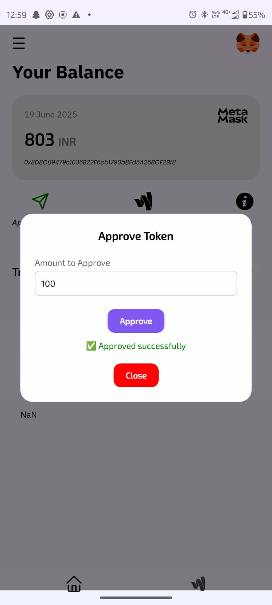

# NeoPay: NFC Tap-to-Pay Blockchain Payment System for College Campuses

<p align="center">
  
  
  
  
</p>

## ✨  Overview

NeoPay is an innovative, decentralized payment system designed specifically for college campuses, leveraging the power of blockchain and NFC technology. It offers a secure, instant, and offline alternative to traditional payment methods like UPI, addressing critical reliability and efficiency gaps.

By integrating a UTXO-based model with student ID cards (NFC), NeoPay empowers users with full control over their funds through their Web3 wallets, enabling seamless tap-to-pay experiences without relying on internet connectivity.


## 🔗 Overview
**Built for**: College campuses

**Tech stack**: Polygon, React Native, Web3.js, NFC

**Inspired by**: UPI, but made more reliable for campus-scale microtransactions
## 🌟 Key Features

* **Decentralized Fund Control:** Users retain complete ownership and control of their funds directly in their Web3 wallets, embodying the true spirit of decentralization.
* **UTXO-Based Efficiency:** Utilizes a Unspent Transaction Output (UTXO) model stored directly on NFC-enabled student ID cards, ensuring gas-efficient and streamlined transactions.
* **Offline Transaction Capability:** Enables instant and fail-proof payments even without internet access, solving a critical reliability challenge faced by conventional online payment systems.
* **Instant & Secure Payments:** Experience near-instant transaction finality, enhancing the speed and efficiency of cafeteria queues.
* **Designed for Campus Ecosystems:** Tailored to the unique needs of college campuses, providing a robust and convenient payment solution for students and merchants.
* **Dedicated User & Merchant Interfaces:**
    * **User Application (React Native):** Allows students to view their card balance and transaction history.
    * **Merchant Application (React Native):** Provides cafeteria merchants with a clear overview of incoming transactions.

## 🧱 System Architecture


This diagram illustrates the full transaction flow between:
- **Top-Up Machine**: Handles token issuance and NFC writing
- **Smart Contract**: Manages UTXO lifecycle (issue, verify, burn)
- **Merchant Machine**: Accepts payments, validates UTXO, and logs transactions
- **User App**: Views balances, manages cards, and secures UTXOs

## 🚀 Technologies Used

* **Blockchain:** Polygon (for its scalability and low transaction fees)
* **Frontend:** React Native (for cross-platform mobile applications)
* **NFC Integration:** For seamless tap-to-pay functionality
* **Web3.js/Ethers.js:** For blockchain interaction (implied for Web3 wallet integration)
* **Solidity:** For smart contract development (implied for UTXO logic)


### 🔒 Security
- All UTXOs are signed by the merchant and stored both locally and on-chain and verified on each transaction
- Smart contract checks prevent double-spending
- Lost cards can be revoked via app to avoid misuse

## 🛝 Flow

## Top Up Flow


### Payment Flow
```mermaid
sequenceDiagram
    participant User
    participant Merchant
    participant NFC
    participant Redis
    participant Polygon

    Merchant->>Merchant: Initiate ₹100 payment
    User->>NFC: Tap NFC card
    Merchant->>NFC: Read UTXO from card
    Merchant->>Redis: Check if UTXO is already spent
    alt UTXO valid
        Merchant->>Polygon: burnUtxo(utxoId)
        Polygon-->>Merchant: Burn confirmation
        Polygon->>Polygon: Emit TransactionEvent
        Merchant->>User: Payment successful
    else UTXO invalid or spent
        Merchant->>User: Payment rejected
    end


  ```


## Screenshots

### Merchant

|  |  |
|:--:|:--:|
|  |  |

### Users

|  |  |
|:--:|:--:|
|  |  |


### Setup
- Deploy JIIT Token
- Use CA of token in deploying the UTXO Contract
- Setup the merchant app ``npm install``
- Enter config details in the config.ts
- Similar setup for user app


  


